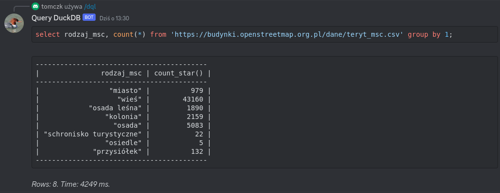

# serverless-duckdb-bot
Discord bot that runs SQL queries using DuckDB on fully serverless architecture.

Responds to `/dql` slash command e.g. `/dql select 42`

## Local development environment
You'll need a current v3 version installation of the [Serverless Framework](https://serverless.com) on the machine you're planning to deploy the application from.

Also, you'll have to setup your AWS credentials according to the [Serverless docs](https://www.serverless.com/framework/docs/providers/aws/guide/credentials/).

Scripts in `package.json` assume that AWS CLI was configured with profile: `serverless-duckdb-bot`.

Deployment: `npm run deploy`

Discord configuration:
- discord application/bot is created in https://discord.com/developers/applications
- Interactions Endpoint URL: your /event endpoint, full path will be in terminal after deploy or you can check it in AWS console
- env vars for `.env` you will get from discord developer portal for you app, DEVELOPMENT_GUILD_ID is not needed
- bot needs following scopes: [bot, application.commands, use slash commands]
- run `npm run sync` manually to register command with discord
- bot needs to be in a server (at least one) to work, otherwise discord seems to kick it out

## Based on
- https://github.com/tobilg/serverless-duckdb
- https://github.com/Snazzah/slash-create-vercel
